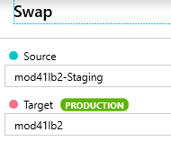

# Preparing for the demos

These steps must be executed everytime that you prepare to run the demos. The steps are fairly fast to execute but we recommend taking a little time to do these steps before your presentation. Typically we start preparing the demos about one hour before the presentation time.

## Making sure that the correct slots are in place

1. Open the App Service you created.

2. In the Overview, click on the URL and make sure that the version with the typos is shown.

- The typos are in the navigation menu. One menu is titled "Applyances" and the other is "Sinq".
- If you cannot see the navigation menu, zoom out a little in the web browser until it is shown.

> If the correct version is shown, go to `7.` below.

3. If the incorrect version (with typos) is shown, click on `Swap`.

4. Select `Staging` for the Source.

5. Select the production website for Production.

6. At the bottom of the page, click on the `Swap` button.

> Jump here if the correct versions of the website are shown in the correct slots.

7. Click on Deployment slots again.

8. Make sure that the Traffic is set to 100% for the production site.

9. Open the `Staging` deployment slot and make sure there are no typos in the menu.

10. In the Staging slot, open the website (from the Overview menu).

11. Log into the shopping cart and make sure that this throws error.

12. Click the Back button to stop the flow of errors and then log out of the shopping cart.

13. In the App service in the portal, click Back to go back to the root's Deployment slots menu.

14. Open the `AbTest` deployment slot and make sure that it's red.

## Mangling the connection string

1. Go back to the production slot of the website. 

> Make sure that you are indeed in the Production slot. The title should show `mod41[prefix]` and **not** `Staging (mod41[prefix]/Staging)`. If you are in the Staging deployment slot, use the breadcrumbs on top of the page to navigate back to the Production slot.

2. Click on Configuration.

3. Click on `Advanced Edit`.

4. Scroll down to `MongoConnectionString` and change the value. For example you can change the first part of the string from `mongodb://mod41[prefix]-mongo` to `mongodb://mod41[prefix]-mongo123`.

> After you save the settings, you need to wait a few minutes for the web application to restart.

5. Go back to the App service's Overview and open the website in a new window.

6. Click on `Login`.

7. Enter your login credentials.

8. Click on the Shopping cart icon.

> At this point you should see some errors. It means that your mangling of the connection string actually worked. You can then close the window.

## Slides

1. Start the presentation :)

[The demo is described in details here](./04-demo.md). Have fun!